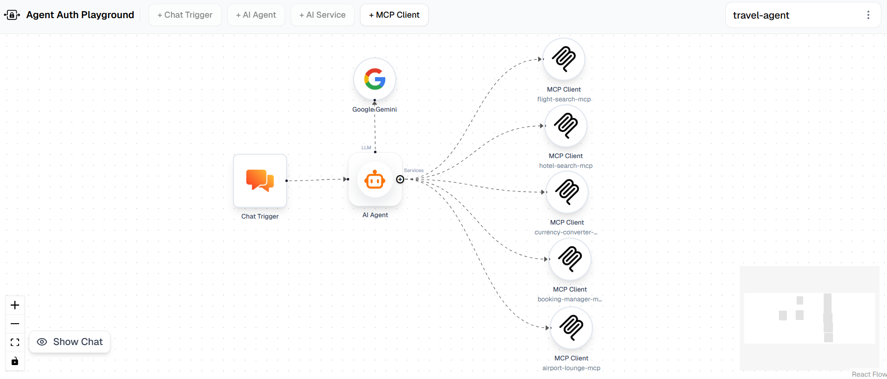

<p align="center">
  
  <h1 align="center">
    Agent Auth Playground
  </h1>
</p>
<p align="center" style="font-size: 1.2rem;">
  A visual, browser-based AgentFlow builder for designing and testing authentication-aware agentic pipelines. Connect LLM nodes, AI agents, and MCP (Model Context Protocol) tool servers on a drag-and-drop canvas, then test them interactively in a built-in chat panel.
</p>

<div align="center">
  <a href="./LICENSE.txt"></a>
  <a href="https://www.npmjs.com/package/agent-auth-playground"></a>
  <br>
  <br>
</div>

<br>



---

## Quick Start (npx)

The fastest way to try agent-auth-playground is with `npx`.

Just run:

```bash
npx agent-auth-playground
```

The local server starts on `http://localhost:4829` and your browser opens automatically.

For advanced setup options, see the [Running Agent Auth Playground Guide](documentation/running-agent-auth-playground.md).

### Try a Simple AgentFlow

When you launch the app, a sample AgentFlow is automatically loaded to showcase the platform’s core capabilities.
1. Configure the LLM node by selecting a provider (OpenAI, Gemini, or Anthropic) and adding your API key.
2. Add and configure an MCP client node (without OAuth2).
3. Run the flow and experiment with tool calls within the agentic loop.


#### Securing this Simple AgentFlow

To secure this AgentFlow, integrate authentication using Asgardeo or WSO2 Identity Server. Follow the below steps to enable authentication and protect tool access within this flow.

##### Prerequisites

Sign up for an account at [Asgardeo](https://asgardeo.io/), or download and set up WSO2 Identity Server from the [official website](https://wso2.com/products/downloads/?product=wso2is).

##### Step 1 - Configure the AI Agent Node

1. Register an Interactive AI Agent by following this [guide](https://wso2.com/asgardeo/docs/guides/agentic-ai/ai-agents/register-and-manage-agents/#registering-an-ai-agent). Make sure to set the callback URL to `http://localhost:4829` during registration.
2. Double-click the AI Agent node. In the **+ Add Agent Credentials** section, enter the obtained Agent ID, Agent Secret, Base URL, and Agent Application Client ID, then click **Save**.
3. Click **Test Fetching an Agent Token** button to verify that the credentials are correct and a token can be fetched successfully.

##### Step 2 - Configure the MCP Client Node

1. Register an MCP Client application by following this [guide](https://wso2.com/asgardeo/docs/guides/agentic-ai/mcp/register-mcp-client-app/).
2. Double-click the MCP Client node and enable the **Use MCP OAuth2** toggle.
3. Under **OAuth2 Configuration**, enter the Base URL and Client ID of the registered MCP Client application.
4. Scopes are optional and depend on your MCP server configuration. If your MCP server requires specific scopes, add them in the **Scopes** field.
5. Your MCP server also needs to be secured with the same identity provider. Follow this [guide](https://wso2.com/asgardeo/docs/quick-starts/mcp-auth-server/) to set that up.
6. Click **Initialize & Connect** to verify that tool discovery succeeds and the connection to the MCP server is established.

##### Step 3 - Running the Flow

Once configured, use the Chat panel to trigger the flow. After each execution, click **View Auth Flow** to open the Auth Flow Inspector, which displays a sequence diagram of all authentication steps and tool calls that occurred during the AgentFlow execution.

---

## Features

- **Visual AgentFlow Editor** - drag-and-drop canvas powered by React Flow; connect nodes with typed handles that enforce valid topologies
- **Four Node Types** - ChatTrigger, LLM (OpenAI / Gemini / Anthropic), AIAgent (agentic loop with tool-calling), MCPClient (MCP server bridge)
- **Agentic Loop** - the AIAgent node iteratively calls an LLM and dispatches MCP tools up to a configurable step limit, then synthesizes a final answer
- **OAuth2 / PKCE Authentication** - Agent credentials (from Asgardeo) and OBO (On-Behalf-Of) token exchange in action
- **Auth Flow Inspector** - every run produces a structured trace; a sequence-diagram view shows every auth step and tool call
- **Streaming Execution** - The canvas lights up node-by-node as the AgentFlow runs
- **localStorage Persistence** - AgentFlows, memory, API keys, and MCP tool caches all survive page refreshes with no server-side state

---

## Resources

### Documentation

- [Getting Started](documentation/getting-started.md) - Build your first AgentFlow in a few minutes
- [AgentFlow Editor](documentation/agentflow-editor.md) - Canvas controls, connections, and keyboard shortcuts
- [Persistence](documentation/persistence.md) - What is stored in your browser and how to manage it

**Nodes**
- [Chat Trigger](documentation/nodes/chat-trigger.md) - Entry point of every AgentFlow
- [AI Agent](documentation/nodes/ai-agent.md) - Reasoning engine with tool-calling loop
- [AI Service](documentation/nodes/llm.md) - Direct call to OpenAI, Gemini, or Anthropic
- [MCP Client](documentation/nodes/mcp-client.md) - Bridge to an external MCP tool server

### Example Agent Flows

- [Travel Agent](example-agentflows/travel-agent.json) - An travel agent that uses MCP tools to plan travel

---

## Contributing

Contributions are welcome. Please open an issue to discuss what you'd like to change before submitting a pull request. For bugs, include steps to reproduce and the browser console output if relevant.

---

## License

[Apache 2.0](LICENSE.txt)
