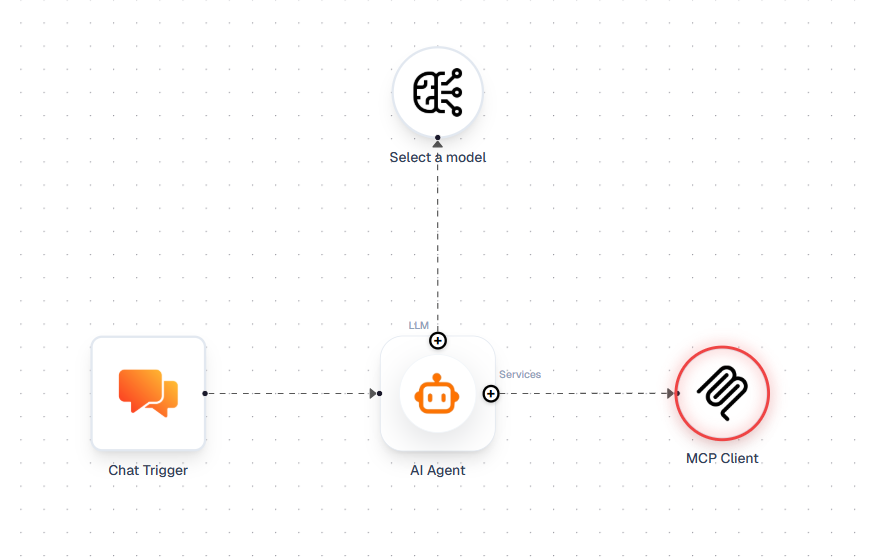

# Secure Simple AgentFlow Guide

This guide walks you through securing a simple AgentFlow using authentication with Asgardeo or WSO2 Identity Server. The simple AgentFlow we are securing is shown below:

## Prerequisites

Sign up for an account at [Asgardeo](https://asgardeo.io/), or download and set up WSO2 Identity Server from the [official website](https://wso2.com/products/downloads/?product=wso2is).

## Step 1 — Configure the LLM Node

Open the LLM node and enter your provider secrets before proceeding to the auth-related configuration below.

## Step 2 — Configure the AI Agent Node

1. Register an Interactive AI Agent by following this [guide](https://wso2.com/asgardeo/docs/guides/agentic-ai/ai-agents/register-and-manage-agents/#registering-an-ai-agent). Make sure to set the callback URL to `http://localhost:4829` during registration.
2. Double-click the AI Agent node. In the **+ Add Agent Credentials** section, enter the obtained Agent ID, Agent Secret, Base URL, and Agent Application Client ID, then click **Save**.
3. Click **Test Fetching an Agent Token** button to verify that the credentials are correct and a token can be fetched successfully.

## Step 3 — Configure the MCP Client Node

1. Register an MCP Client application by following this [guide](https://wso2.com/asgardeo/docs/guides/agentic-ai/mcp/register-mcp-client-app/).
2. Double-click the MCP Client node and enable the **Use MCP OAuth2** toggle.
3. Under **OAuth2 Configuration**, enter the Base URL and Client ID of the registered MCP Client application.
4. Scopes are optional and depend on your MCP server configuration. If your MCP server requires specific scopes, add them in the **Scopes** field.
5. Your MCP server also needs to be secured with the same identity provider. Follow this [guide](https://wso2.com/asgardeo/docs/quick-starts/mcp-auth-server/) to set that up.
6. Click **Initialize & Connect** to verify that tool discovery succeeds and the connection to the MCP server is established.

## Running the Flow

Once configured, use the Chat panel to trigger the flow. After each execution, click **View Auth Flow** to open the Auth Flow Inspector, which displays a sequence diagram of all authentication steps and tool calls that occurred during the AgentFlow execution.
